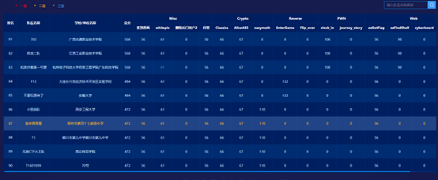
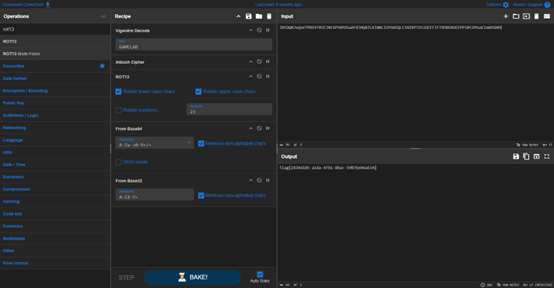
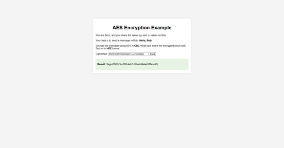
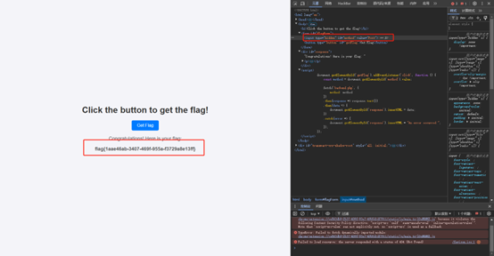

# 一、战队信息
战队名称：就来看看题
战队排名：87
# 二、解题情况

# 三、解题过程
## 1、签到漫画
操作内容：
四个漫画每个翻到最后一页，每页有四分之一的二维码，用ppt（不会用其他软件·＞﹏＜）把图拼一下，使用在线扫描，url后面即为flag


扫描结果：
http://weixin.qq.com/r/4BIrMz7ES2M0rXpQ90fy?flag{youthful_and_upward}

flag值：
flag{youthful_and_upward}
## 2、whitepic
操作内容：
使用010editor发现是个gif文件，扔到https://ezgif.com/maker（这网站还是在文件里的create by找到的）里发现第二张就是flag


 
flag值：
flag{passion_is_the_greatest_teacher}
## 4、问卷
操作内容：
填写完调查问卷即可https://www.wenjuan.com/s/UZBZJvmmIG/

flag值：
flag{thank_you_for_your_support}
## 5、Classics
操作内容：
下载后发现是CyberChef的样子，使用CyberChef照着那几个编码弄上去，但是改成decode
发现不对，改了改rot13的amount，解出来了
（本来上午用ciphey就跑出来了，结果上午跑出来了，下午死活卡死，顶不住啊，用CyberChef再弄了一遍＞﹏＜ )



flag值：
flag{2834d185-a1da-4fb1-8bac-59076eb6a634}
## 6、AliceAES
题目翻译：
AES 加密示例
你是 Alice，你和 Bob共享相同的key和iv值。
你的任务是向鲍勃发送一条消息：你好，鲍勃！
使用CBC模式的 AES 加密消息，并以HEX格式与 Bob 共享加密结果。

操作内容：
直接用key和vi值，找一个aes加密的网站，加密即可



flag值：
flag{41865c5e-f20f-44b1-85a4-844a4578ead0}
## 7、easymath
操作内容：
先枚举一下前几个，发现有规律
```py
from Crypto.Util.number import *
from gmpy2 import next_prime
for l in range(1,100):
    key=0
    for k in range(2**(l-1),2**l):
        s=bin(k)[2:]
        if(k%2==1 and '1111' not in s and '0000' not in s):
            key+=1
print(f"当l为{l}时，key为{key}")
#输出
#当l为1时，key为1
#当l为2时，key为1   
#当l为3时，key为2   
#当l为4时，key为3   
#当l为5时，key为7   
#当l为6时，key为12  
#当l为7时，key为22  
#当l为8时，key为40  
#当l为9时，key为75  
#当l为10时，key为137
#当l为11时，key为252
#当l为12时，key为463
#当l为13时，key为853
#当l为14时，key为1568
#当l为15时，key为2884
```
会发现，从第四个开始，四组一循环，第一个为前三个之和减一，第二个为前三项之和加一，第三四项都是前三项之和
所以，算一下第l=2331时的key值即可
```py
from Crypto.Util.number import *
from gmpy2 import next_prime
def calculate_key(l):
    # 初始的前三个key
    keys = [1, 1, 2]  
    for i in range(4, l + 1):
        if i % 4 == 0:  # 第一组，key = 前3个key之和 - 1
            new_key = sum(keys[-3:]) - 1
        elif (i - 1) % 4 == 0:  # 第二组，key = 前3个key之和 + 1
            new_key = sum(keys[-3:]) + 1
        else:  # 第三组和第四组，key = 前3个key之和
            new_key = sum(keys[-3:])
        keys.append(new_key)
    return keys[-1]  # 返回第l个key
l = 2331
key_at_l = calculate_key(l)
print(f"l={l}时的key是: {key_at_l}")
n=739243847275389709472067387827484120222494013590074140985399787562594529286597003777105115865446795908819036678700460141950875653695331369163361757157565377531721748744087900881582744902312177979298217791686598853486325684322963787498115587802274229739619528838187967527241366076438154697056550549800691528794136318856475884632511630403822825738299776018390079577728412776535367041632122565639036104271672497418509514781304810585503673226324238396489752427801699815592314894581630994590796084123504542794857800330419850716997654738103615725794629029775421170515512063019994761051891597378859698320651083189969905297963140966329378723373071590797203169830069428503544761584694131795243115146000564792100471259594488081571644541077283644666700962953460073953965250264401973080467760912924607461783312953419038084626809675807995463244073984979942740289741147504741715039830341488696960977502423702097709564068478477284161645957293908613935974036643029971491102157321238525596348807395784120585247899369773609341654908807803007460425271832839341595078200327677265778582728994058920387721181708105894076110057858324994417035004076234418186156340413169154344814582980205732305163274822509982340820301144418789572738830713925750250925049059
key=key_at_l
p=next_prime(key)
print("---")
print(p)
print("---")
# 直接使用"/"会报错，所以用"//"，再算一下p*q是否等于n
q=n//p
print(q)
print(p*q==n)
#输出
#l=2331时的key是: #24440283427735860782323152407294917357529111353275570975703531438440519660225708967888657253644278000783263820558388701592370615088140947096898134081330591301984360290318641970617489021626752360815885812583176251873031239638493762071047588297627032203293985708994218852662838640238623254740905447146670999830187552717802257362427107073858485019955606331947972091793616373347825119600328855885246072890798551616534636247023983959037046475229361825549780845049341719145179099452625523855259198581865855234803188298849910863377098140158406245399677912502444220011884063994451182221171275547685147549629637310805120815512
#---
#24440283427735860782323152407294917357529111353275570975703531438440519660225708967888657253644278000783263820558388701592370615088140947096898134081330591301984360290318641970617489021626752360815885812583176251873031239638493762071047588297627032203293985708994218852662838640238623254740905447146670999830187552717802257362427107073858485019955606331947972091793616373347825119600328855885246072890798551616534636247023983959037046475229361825549780845049341719145179099452625523855259198581865855234803188298849910863377098140158406245399677912502444220011884063994451182221171275547685147549629637310805120817903
#---
#30246942489892106712702239024133721453592842183923733460515110118344404699532017493383428137697227815754741688919151294652492006534840589468962295623069884232619077280815851563195685517196295248643553001644121714958636538938848623892827992267767358030468030240236589927767000556188518269847757669474128501561192367465343050094302650720121351543751423298130335191141395620744634566228434135430114855211983270131333333081108536699301711234514426855659414263828163630092200163488598896179597996128556748173083374014319100056717308084410389660477779719495877439609162161870536882293104016630319703274657500915447940613453
#True
```
验证发现就是所求的p，q，之后使用加密原理，算逆元d，以求解flag
```py
from Crypto.Util.number import *
from gmpy2 import invert
p=24440283427735860782323152407294917357529111353275570975703531438440519660225708967888657253644278000783263820558388701592370615088140947096898134081330591301984360290318641970617489021626752360815885812583176251873031239638493762071047588297627032203293985708994218852662838640238623254740905447146670999830187552717802257362427107073858485019955606331947972091793616373347825119600328855885246072890798551616534636247023983959037046475229361825549780845049341719145179099452625523855259198581865855234803188298849910863377098140158406245399677912502444220011884063994451182221171275547685147549629637310805120817903
q=30246942489892106712702239024133721453592842183923733460515110118344404699532017493383428137697227815754741688919151294652492006534840589468962295623069884232619077280815851563195685517196295248643553001644121714958636538938848623892827992267767358030468030240236589927767000556188518269847757669474128501561192367465343050094302650720121351543751423298130335191141395620744634566228434135430114855211983270131333333081108536699301711234514426855659414263828163630092200163488598896179597996128556748173083374014319100056717308084410389660477779719495877439609162161870536882293104016630319703274657500915447940613453
e=65537
c=229043746793674889024653533006701296308351926745769842802636384094759379740300534278302123222014817911580006421847607123049816103885365851535481716236688330600113899345346872012870482410945158758991441294885546642304012025685141746649427132063040233448959783730507539964445711789203948478927754968414484217451929590364252823034436736148936707526491427134910817676292865910899256335978084133885301776638189969716684447886272526371596438362601308765248327164568010211340540749408337495125393161427493827866434814073414211359223724290251545324578501542643767456072748245099538268121741616645942503700796441269556575769250208333551820150640236503765376932896479238435739865805059908532831741588166990610406781319538995712584992928490839557809170189205452152534029118700150959965267557712569942462430810977059565077290952031751528357957124339169562549386600024298334407498257172578971559253328179357443841427429904013090062097483222125930742322794450873759719977981171221926439985786944884991660612824458339473263174969955453188212116242701330480313264281033623774772556593174438510101491596667187356827935296256470338269472769781778576964130967761897357847487612475534606977433259616857569013270917400687539344772924214733633652812119743
n = p * q
phi_n = (p - 1) * (q - 1)
d = invert(e, phi_n)
m = pow(c, d, n)
flag = long_to_bytes(m)
print(flag.decode())
#输出
#flag{77310934-21fa-4ee4-a783-dc1865ebab28}
```

flag值：
flag{77310934-21fa-4ee4-a783-dc1865ebab28}
## 12、ezGetFlag
操作内容：
多点几次提示要用post
于是就听劝，将方法改为post
 


flag值：
flag{1aae46ab-3407-469f-955a-f3729a8e13ff}
# 四、总结
虽然说成绩只是87名，后来公众号公布的76名，但是对于初出茅庐的我来说已经很高兴了，希望以后能在CTF的路上走的更远
加油！
d=====(￣▽￣*)b